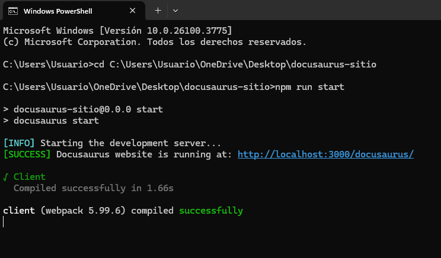

# Sitio web de Docusaurus Mejorado

Este sitio web fue creado con [Docusaurus](https://docusaurus.io/), un generador de sitios web estáticos moderno.

---

## Mejoras Realizadas

1. **Levantar Docusaurus en cPanel**  
   Para levantar Docusaurus en cPanel, sigue estos pasos:
   - Accede a tu cPanel y abre el administrador de archivos.
   - Carga los archivos generados por Docusaurus en el directorio `public_html` o en un subdirectorio de tu preferencia.
   - Configura el servidor para servir el contenido estático generado por Docusaurus.
   - Una vez cargados los archivos, podrás acceder al sitio a través de la URL configurada en tu dominio.

   
   

2. **Dominio Personalizado (dominio.com/docusaurus)**  
   Para asignar un dominio personalizado, configura tu DNS correctamente y actualiza las configuraciones de Docusaurus para que el sitio esté disponible en tu dominio personalizado. La configuración debe incluir el prefijo `docusaurus` para la URL.

   

3. **Menú Lateral con Iconos**  
   Personaliza el menú lateral añadiendo iconos para una navegación más visual. Utiliza bibliotecas de iconos como FontAwesome o Material Icons para mejorar la estética del menú lateral.

   

4. **Personalizar los Estilos (que no se vea que es Docusaurus)**  
   Modifica los estilos CSS y el diseño predeterminado de Docusaurus para darle un aspecto único a tu sitio. Esto puede incluir cambiar colores, fuentes, y el layout para que el sitio no parezca un proyecto genérico de Docusaurus.

5. **Contenido:**
   - **Opción 1: Manual de Uso del Inspector de Elementos**  
     Un manual práctico que te ayudará a comprender cómo usar el inspector de elementos en tu navegador para depurar y modificar el contenido de una página web.
     
     

   - **Opción 2: Manual para Implementar un Gestor de Contraseñas y su Uso Práctico**  
     Este manual explica cómo implementar un gestor de contraseñas para almacenar y gestionar tus contraseñas de manera segura.
     
     

---

## Notas Adicionales

- Si necesitas ayuda con la personalización o configuración, consulta la documentación oficial de Docusaurus [aquí](https://docusaurus.io/docs).